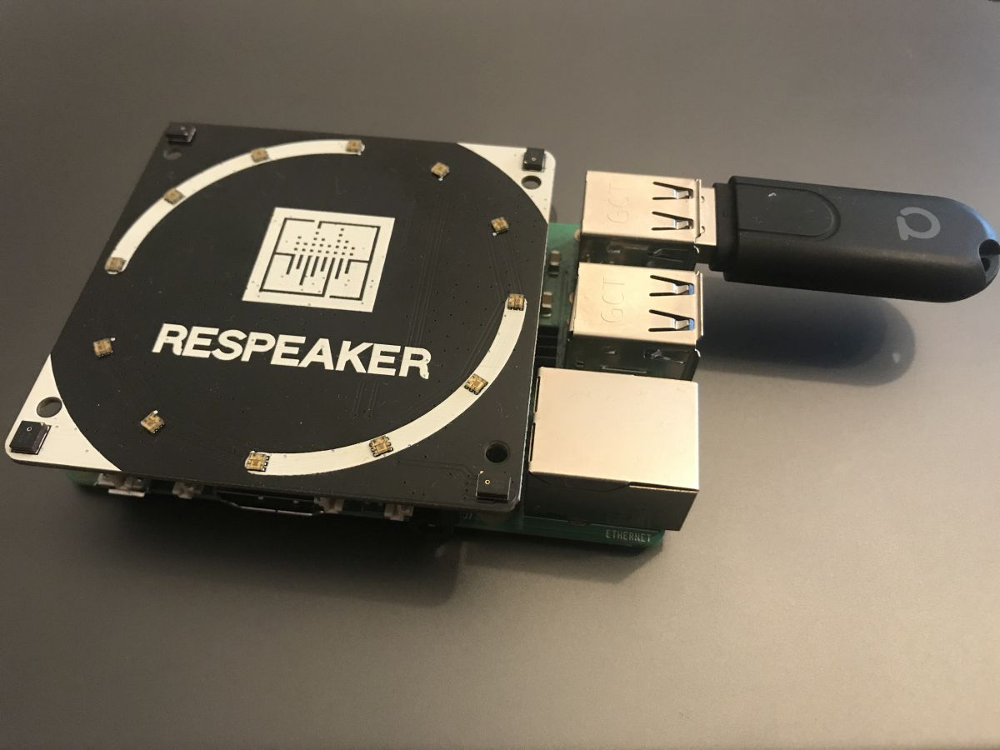

<details close markdown="block">
  <summary>
    Table of contents
  </summary>
  {: .text-delta }
1. TOC
{:toc}
</details>

# Setup Hardware

## Shopping List

To build your own voice assistant, you will need at least the following things:

* Raspberry Pi 3b/3b+/4 with Power Cable
* Micro-SD-Card with a min of 16gb
* ReSpeaker 4-Mic-Array
* Zigbee2MQTT adapter, like [**Texas Instruments CC2531**](/pages/knowledge/zigbee/cc2531) or [**ConBee2**](/pages/knowledge/zigbee/conbee2)
  or ([other compatible adapters](https://www.zigbee2mqtt.io/information/supported_adapters){:target="_blank"})
* Zigbee LED Light Bulb or any other Zigbee device
* Speaker with 3.5mm jack

## Setup Raspberry Pi

The easiest way to set up a Raspberry Pi is to use the 
[**Raspberry Pi Imager**](https://www.raspberrypi.org/software/){:target="_blank"}.

Steps:
1. Insert Micro SD Card
2. Choose OS -> We recommend Raspbian with OS
3. Choose Micro SD Card
4. Click Button **Write**
5. Done!

You can attach a screen, keyboard and mouse to enable SSH and configure WI-FI connection.

The username is ``pi`` and the password is ``raspberry``. 
You should [change the password](https://www.raspberrypi.org/documentation/linux/usage/users.md){:target="_blank"} 
immediately.

## Optionally SSH and WI-FI configuration

If you want to start the Raspberry Pi headless, you can enable SSH and configure the WI-FI connection before starting.

## Enable SSH
{: .no_toc }
You only need to create an empty file with the name `ssh` without any extension in the root directory of the usb stick.
Done!

### Configure WIFI
{: .no_toc }
Create a file with the name `wpa_supplicant.conf` in the root directory of the pi. Fill it with the following code
and adjust `country` to your country, for example DE for germany. 
Also adjust `ssid` and `psk` to your network. 

```
ctrl_interface=DIR=/var/run/wpa_supplicant GROUP=netdev
update_config=1
country=<Insert 2 letter ISO 3166-1 country code here>

network={
 ssid="<Name of your wireless LAN>"
 psk="<Password for your wireless LAN>"
}
```
you can use the command `sudo raspi-config` for additional setting (e.g : change your time zone, set the language, 
Keyboard layout etc.)

Read more about a headless setup 
[here](https://www.raspberrypi.org/documentation/configuration/wireless/headless.md){:target="_blank"}.

## Plugin ReSpeaker and Zigbee Adapter
Attach the ReSpeaker 4-Mic-Array to the Raspberry Pi and plugin the Zigbee Adapter.




## Finish!
Congratulations! You mastered the first step to your own Voice Assistant! 
Go to the [next step](/pages/installation/auto-installation)!
 


