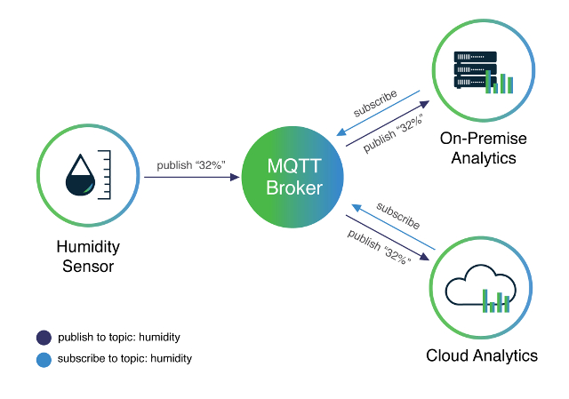

<details close markdown="block">
  <summary>
    Table of contents
  </summary>
  {: .text-delta }
1. TOC
{:toc}
</details>

# MQTT (Message Queuing Telemetry Transport)

## What is MQTT
MQTT is the communication protocol we use to communicate with all devices in our home system.    
It's based on a publish/subscribe model on topics. The publisher sends a 
message to topic to a MQTT-Broker. Every network needs one broker. The broker is running on the raspberry pi. 
When a device publishes a message, it'll be send to the broker. The broker sends the message to all devices 
that subscribed the specific topic. Messages are normally not stored by the Broker. The broker only passes the 
messages to the devices!


*Resource: [behrtech.com](https://behrtech.com/blog/mqtt-in-the-iot-architecture/){:target="_blank"}*

## Client name requirements 
- Client names MUST be unique.
- When a client appears with the same name as another client, the first client will disconnect and the new 
client is connected. But the first client will try to connect again. The result is a never ending loop.

## Messages
Every message contains 
* a topic (similar to a path)
* the message data
* a QOS (Quality of Service) level
* a retain Flag. The retain flag is normally not set, so the Broker will instantly forget the message. 
If the flag is set, the broker will remember the last message where the retain flag is set.

## QOS (Quality of Service) level
Mqtt supports 3 different levels of QOS:   
- QOS-0 is the default level. There is no guarantee that the message will be delivered   
- QOS-1 Guarantees the delivery of the messages, but there could be duplicates.   
- QOS-3 Guarantees, the delivery of the messages. 

## What is a topic?
A topic is the location/name of the message. It identifies it and helps the broker to pass the messages to the clients.   
Topics looks like paths for example `'rhasspy/audioServer/devices)'` or `'house/room/main-light'`.
When you subscribe you can also use wildcards. ` + ` is a single wildcard (replaces one character) and ` # ` is a 
multi wildcard( replaces many characters). When you publish you can't use wildcards.

## Which MQTT topics are supported?
All available topics in rhasspy can be found here: 
[MQTT API](https://rhasspy.readthedocs.io/en/latest/reference/#mqtt-api){:target="_blank"}

## How does the data look like?
The data you publish or subscribe are nothing else than JSON objects. Let's take a look at ``hermes/tts/say``, 
in the [MQTT API](https://rhasspy.readthedocs.io/en/latest/reference/#text-to-speech){:target="_blank"} you can see 
the topic ``hermes/tts/say`` requires 5 different values.
This could look like this:
```json
{
    "text": "Example Text", 
    "lang": null, 
    "id": null, 
    "siteId": "default",
    "sessionId: null
}
```
In this topic you can shorten it a bit. There are some values with a datatype with a '?' behind. You can left them 
null of you simply won't mention them like this:
```json
{
    "text": "Example Text", 
    "siteId": "default"
}
```
The same principle is used when you subscribe a topic. For example the topic ``hermes/tts/sayFinished`` it's published 
by the TTS system, when it has finished speaking (after ``hermes/tts/say``).
When you subscribed to this topic, you will get the following data:
```json
{
    "id": null, 
    "siteId": "default"
}
```
When you setup an id at the data in ``hermes/tts/say`` there will be the same id in the ``hermes/tts/sayFinished`` data.
With NodeRed or Python it's really simple to create, edit or read JSON data.
