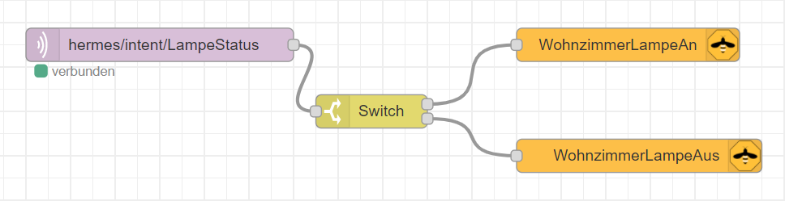

<details close markdown="block">
  <summary>
    Table of contents
  </summary>
  {: .text-delta }
1. TOC
{:toc}
</details>

# Node-RED

Node-RED is described as flow base programming for the internet of things. Node-Red  is installed by default on your Raspberry Pi but as you will like to use it with the rhasspy , it is  useful to reinstall it and start Node-Red as service on Rhasspy.

# Installation of node-RED

this command shows how to install Node-Red , Nodejs , Mosquitto as your MQTT Server in a simple line of commands.

```
sudo apt-get install mosquitto mosquitto-clients -y
bash <(curl -sL https://raw.githubusercontent.com/node-red/linux-installers/master/deb/update-nodejs-andnodered)
sudo systemctl enable nodered.service # start Node-Red as service

```
Node-Red is now available at http://<hostname>:1880 

# Setting a password for the your node-Red [Optional]

if you want you can set a password  to your Node-Red  with following command 
```
sudo npm install -g node-red-admin # install node-red- admin package from node red package manager for global usage
node-red-admin hash-pw # create a new passwort for your Node-Red, You will get a hash value as output.
nano ~/.node-red/settings.js # open settings.js files and uncomment adminAuth Object and set password  to the new created hash value 
node-red-stop #stop Node red
node-red-start # start node-red to make the change activ

```
# Nodes

Once you have Node-REDE opened, you can see different Nodes available and over the menu button , you can add additional new packets.
Here are some important Nodes : 

- Switch: Checks, according to individual conditions, to which output the node sends the message
should be forwarded.

- Change: Allows you to change individual properties in the message payload. So you can
Simply exchange parts of the message (or the entire message).
- Function: Probably the most powerful node, but also the most complicated. Here you can
Program freely in JavaScript and manipulate the messages or completely new messages
hand back
- RBE: Blocks further messages at the inbox until a change takes place. Here can
either the complete payload can be checked, or just a single property of the
Payload
- HTML: Extracts certain elements from a complex HTML construct using CSS selectors. Very practical for quickly collecting individual values.
- Delay: Delays the incoming message by the set (or a random) time until it arrives
the output is passed on
- Trigger: Converts messages into a "status". E.g. ensure that the
Status is held "HIGH" as long as new messages are received.

# Setup a light
there are different ways to set up a light. This example is based on setting a light with Hermes and Zigbe2MQTT protokoll.
To start with Node Red setting your device should be connected to Zigbee2MQTT brocker. Have a look on 
[zigbee2mqtt](/pages/knowledge/zigbee/zigbee2mqtt) to see how  you can connect your devices.


- first create a bridge by selecting Zigbee2mqtt Bridge Node, then enter an optional name for the bridge, Locallhost for the Host , zigbee2mqtt for Base Topic and 1883 for the Mqtt Port
- select MQTT IN node and enter the Topic name as well as the Server. In this example the Server name is : 127.0.0.1: 1883 and the topic is hermes/intent/LampeStatus (Note: the same Intent should be available on Rhasspy Sentences site)
- then select a switch with available status for the light. In this case with have only two status : ON or OFF
- finally select your Zigbee2Mqtt Out Nodes to handle the status of your light





In the same way, you can set up the color and the brightness of your Light, if your light has these  properties.


# setup an alarm clock

# Get weather Information