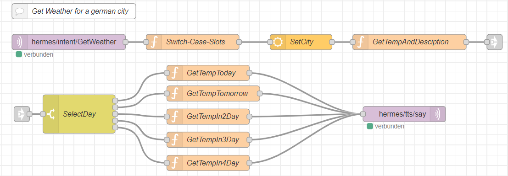

<details close markdown="block">
  <summary>
    Table of contents
  </summary>
  {: .text-delta }
1. TOC
{:toc}
</details>

# Weather forecast
The weather forecast allows the user to get the weather information of a specific date. For the Implementation we will use Node-red and Hermess MQTT protokoll.

## Setup the intent in sentence.ini
the specification for the intent can be like :

```
[WeatherForecast]
city_name=(cologne| Bergisch Gladbach | Paris ){city}
date =(heute| Morgen| in zwei Tagen| in drei Tagen| in vier Tagen){day}
Wie ist das Wetter  <date> in <city_name>

```
1.  First a city name needs to be specify.This  name can be obtained through a databank, where the city and country name are stored. To keep it simple in this exemple, we can just put some cities' names as a list.
2.   the next thing is to get the date on which the weather forecast will be estimated. For this purpose we are use Openweathermap Node , which allow us to get the temperature for five days successively starting from 00:00:00  till 21:00:00 in a step of tree hours. (` e.g  for each day we can get the forecast for 00:00:00, 03:00:00 , 06:00:00 etc..`). 
The only downside to this NODE is that we can only get the weather information of the hour, which are divisible by three. It will not be able to get the forecast for 10 O'clock. If the user requests a forecast at 10 o'clock, he will get the forecast for the  next hour which is divisible by tree and in this case the forecast for 12 o'clock will be output : The function named `GetTempAndDesciption` handles this logic.
3. we need also to store the value for the date and pass it to the switch Node , which will differentiate between different forecast day. The function GetCity handles this by storing the date in a flow  variable and this variable is then accessible everywhere in the flow. (` e.g : with flow.set ('day', msg.payload.slots[0].value.value) we can store the date with variable name day and with flow.get ('day'), the value can be fetched;`)
4.  The switch node as already mentioned, will delegate the  weather forecast according to the date to a specific function and the hermess Mqtt out node  will publish the message set in the function.


