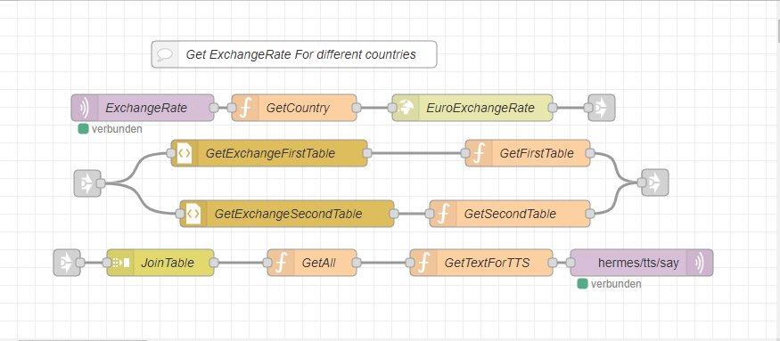

<details close markdown="block">
  <summary>
    Table of contents
  </summary>
  {: .text-delta }
1. TOC
{:toc}
</details>

# Exchange Rate
The goal of this theme is to allow the user to get the exchange rate for a specific currency for a specific country converted to Euro.
To get all the information about the current exchange rate, we use the API with the URL `https://wechselkurse-euro.de/`. From this URL we can extract the table for different countries and their currency value corresponding to €1.
We need a HTTP request node to fecht the value from the internet and some knowledge of css to load the information we are looking for. Since the values are represented in two different tables, we also need a join node to combine the two tables. Finally, a function called GetAll combines the two tables and sends them to another function called GetTextForTTs, which forwards the message to the TTS node.
For the intent, we also use a custom slot called ExchangeCounties to store different countries.
The intent is something like the following:

```
[GetExchangeRate]
Exchange rate for ($ExchangeCountries){country}
```
The slot list named ExchangeCountries can be downloaded from [here ](https://github.com/th-koeln-intia/ip-sprachassistent-team4/blob/master/data/ExchangeCountries).

From the intent we get the country name and pass it to the table to get the currency value and currency name. 
The TTS output is : 
```
1 € corresponds to <name of country currency>.
```
The following figure shows the nodes used.



# Download the flow
- [Download](https://github.com/th-koeln-intia/ip-sprachassistent-team4/blob/master/flows/exchange_rate.json){:target="_blank"}
