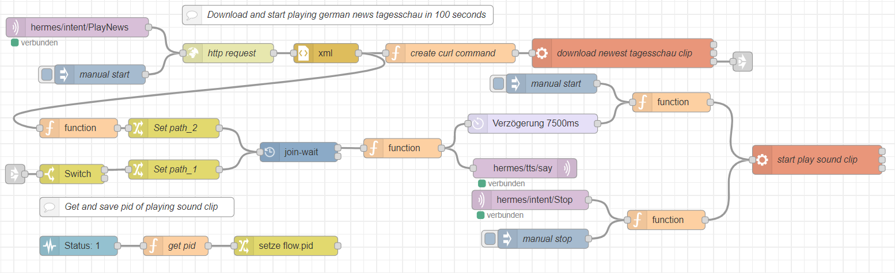

  

    Table of contents
  

  {: .text-delta }
1. TOC
{:toc}

# Daily News In 100 seconds

Here is a flow to get the latest audio clip from the german news tv program "tagesschau". The clip is about
100 seconds long. 

To use this flow, you need to install the package `mpg123` on your Raspberry Pi:

`sudo apt install mpg123 -y`

You also need to add the node [node-red-contrib-join-wait](https://flows.nodered.org/node/node-red-contrib-join-wait){:target="_blank"} to your node-red.

After installing the `mpg123` and the `join-wait` node, 
import our flow from [our github repository](https://github.com/th-koeln-intia/ip-sprachassistent-team4/blob/master/flows/news_in_100_seconds_de.json){:target="_blank"}

## Download the flow
- [Download](https://github.com/th-koeln-intia/ip-sprachassistent-team4/blob/master/flows/news_in_100_seconds_de.json){:target="_blank"}
