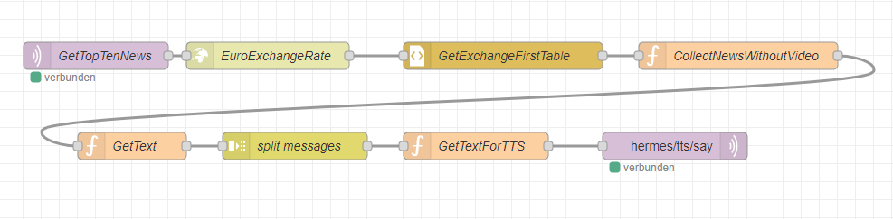

<details close markdown="block">
  <summary>
    Table of contents
  </summary>
  {: .text-delta }
1. TOC
{:toc}
</details>

# Headline HTTP
All information about the current news can be found on the website from n-tv `https://n-tv.de/` and we are just copying the first 10 topics and sending it to  TTS node.
We need an HTTP Request node to get the information from the website and after that use css to collect the information which we are looking for.
The information load from the URl is stored in array.The first value from each payload is the topic from the new (e.g : Politic), the second is the Title and the third one is a brief description of the new : the function named ` CollectNewsWithoutVideo` handelt this.
 
the intent is something like :

```
[GetTopTenNews]
current top news.

```
The TTS will then output the first ten news from n-tv web page 

Picture below shows the complete nodes used.



# downlod the complete flow
- [Download](https://github.com/th-koeln-intia/ip-sprachassistent-team4/blob/master/flows/headlines_http_req_de.json)
