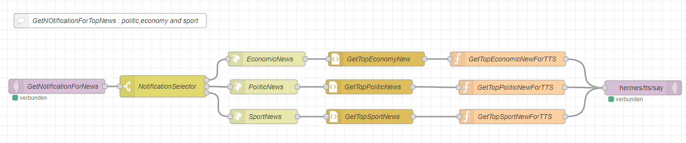

<details close markdown="block">
  <summary>
    Table of contents
  </summary>
  {: .text-delta }
1. TOC
{:toc}
</details>

# Top News Notification HTTP
The purpose of this topic is to allow the user to get the new notification from sport, economy and politics.
We use three different HTTp requests to collect the top news from each topic.
From the intent we extract the specific topic name (`e.g: politic`) and pass it to a switch-node named `NotificationSelector`, which will then pass the information to the corresponding HTTP request Node. From the HPPT node, the first Topic on n-tv website is fetched and sent to TTS node.
 
the intent is something like :
 
```
[GetNotificationForNews]
top new from economy{economy}
top new from politic{politic}
top new from sport{sport}
 
```
The TTS will then output the first news corresponding to the topic set in intent.




# Downlod the flow
- [Download](https://github.com/th-koeln-intia/ip-sprachassistent-team4/blob/master/flows/top_news_notification.json){:target="_blank"}
