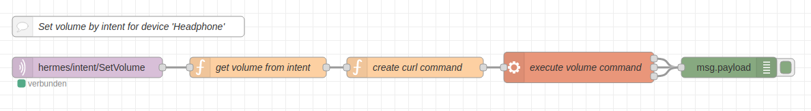

  

    Table of contents
  

  {: .text-delta }
1. TOC
{:toc}

# Set Volume

Here is a flow to set the headphone jack's volume.

Import our flow from [our github repository](https://github.com/th-koeln-intia/ip-sprachassistent-team4/blob/master/flows/set_volume.json){:target="_blank"}

