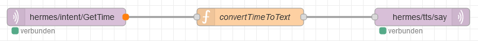

<details close markdown="block">
  <summary>
    Table of contents
  </summary>
  {: .text-delta }
1. TOC
{:toc}
</details>

# Current Time

This is the most basic skill Sherlock provides. With this skill you can ask for the time and
Sherlock answers with a small phrase containing the current time.

## How does it work?
This skill was realized with [NodeRed](/pages/knowledge/node-red), the flow is only three nodes big:
[](../../assets/getTime.png)


The left node catches the GetTime intent. The function `convertTimeToText` gets the current Time and converts it 
into a nice text Sherlock should say. And the right node publishes the MQTT message with the text of the function 
to trigger the TTS.
This is the content of the function `convertTimeToText`:
```javascript
var time = new Date()
msg.payload = {text: "Es ist " + time.getHours() + " Uhr " + time.getMinutes(), siteId: "default", id: "testID"};
return msg;
```

## Downlod the flow
- [Download](https://github.com/th-koeln-intia/ip-sprachassistent-team4/blob/master/flows/get-time.json)