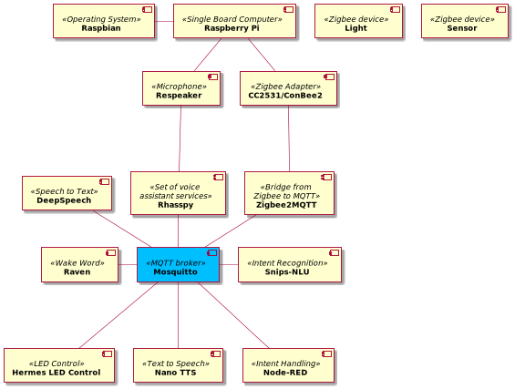

# Technology Evaluation

This section of the documentation is about the technology evaluation of the software we used and partly tested. After a
short explanation, we highlight the advantages and disadvantages of the respective software. We then briefly summarise
these in a conclusion and supplement this with a personal opinion and experiences. Each sub-page deals with a separate
topic.

# Overview

In addition to the subpages, we evaluate the software used in a clear table.

| Service                         | Technology         | Installation             | Configuration     | Usability | Error rate | Documentation |
|---------------------------------|--------------------|--------------------------|-------------------|-----------|------------|---------------|
| Speech to Text                  | DeepSpeech         | Hard without experience* | Easy              | Medium    | High       | Good          |
| LED Control                     | Hermes LED Control | Medium                   | Easy              | Good      | None       | Medium        |
| Text to Speech                  | Mozilla TTS        | Hard                     | Easy              | Bad       | Medium     | Medium        |
| Text to Speech                  | Nano TTS           | Easy                     | Easy (in Rhasspy) | Good      | None       | Bad           |
| Intent Handling                 | Node-RED           | Easy                     | Easy              | Medium    | Low        | Good          |
| Wake Word                       | Raven              | Easy                     | Easy (in Rhasspy) | Good      | Low        | Good          |
| Set of voice assistant services | Rhasspy            | Easy                     | Easy              | Medium    | None       | Good          |
| Microphone                      | ReSpeaker          | Medium                   | None              | Good      | None       | Good          |
| Intent Recognition              | Snips-NLU          | Hard without experience  | Medium            | Good      | Low        | Good          |
| MQTT broker                     | Mosquitto          | Easy                     | Easy              | Good      | None       | Good          |
| Single Board Computer           | Raspberry Pi       | Easy                     | None              | Good      | None       | Good          |
| Operating System                | Raspbian           | Easy                     | Medium            | Good      | Medium     | Good          |
| Zigbee Adapter                  | CC2531             | Easy                     | None              | Good      | None       | Medium        |
| Zigbee Adapter                  | ConBee2            | Easy                     | None              | Good      | None       | Good          |
| Bridge from Zigbee to MQTT      | Zigbee2MQTT        | Easy                     | Medium            | Medium    | None       | Good          |

*as for German pretrained model

# Statement for disability and educational assistance
The system is only suitable for use in the disability and educational assistance, if none of the operators has a strong 
speech accent or a speech impediment, otherwise the spoken sentences will not be recognized correctly with DeepSpeech. 
If this is not the case, it can be used to control Zigbee devices very well. This is also very practical for the 
handicapped or for educational aids who do not have a free arm to switch on the light or to lower the shutters.
With NodeRED you can also easily automate daily sequences so that you don't have to do them every time.
Problems could arise, however, if children like to turn lights on and off, by voice this is much easier than with normal 
light switches. Normal light switches may be more difficult for children to reach. 
The Rhasspy system is a very robust system that runs without further maintenance without any problems, it does not crash
 and does not need internet for the simple skills (time, access to Zigbee sensors and actuators). Even if you pull the 
 plug, the system does not get destroyed.  This must then only be plugged in and after a few minutes, 
 the voice assistant works again.

Most importantly, the Rhasspy voice assistant is privacy compliant, unlike Google Assistant and Alexa. Rhasspy works 
completely autonomously without sending voice files or private data to the Internet, as mentioned above, it also works 
without an Internet connection.

# Software/Hardware overview

In the following component diagram, all the technologies listed above have been brought together in relation.

